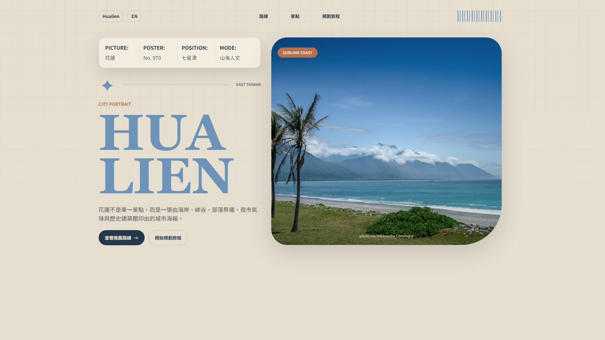

# City Travel Site Template

A reusable Vue 3 + Vite + TailwindCSS template for city travel guides, local tourism campaigns, boutique stays, destination brands, and itinerary landing pages.

The template is based on a finished Hualien travel guide demo, but the implementation has been renamed and documented so the content can be replaced from data files instead of editing the Vue layout components.



## Live Demo

Original demo site:

https://hualien-855.netlify.app

## Stack

- Vue 3
- TypeScript
- Vite
- TailwindCSS
- Netlify-ready static deployment

## Quick Start

```bash
npm install
npm run dev
```

Build for production:

```bash
npm run build
```

Preview the production build:

```bash
npm run preview
```

## Customize Content

Most site content lives in `src/data`.

| File | Purpose |
| --- | --- |
| `src/data/hero.ts` | Site title, metadata, navigation labels, hero copy, and large title lines |
| `src/data/images.ts` | Image URLs, dimensions, alt text, credits, and source links |
| `src/data/features.ts` | Main feature/place cards |
| `src/data/story.ts` | Route, timeline, or story section |
| `src/data/culture.ts` | Culture, highlights, or local detail cards |
| `src/data/planner.ts` | CTA, email link, map link, and itinerary packages |
| `src/data/sources.ts` | Footer source links or brand references |
| `src/data/siteContent.ts` | Main content composition entry point |

## Create A New City Site

1. Click **Use this template** on GitHub.
2. Create a new repository for the city, hotel, route, or local brand.
3. Update `brandLabel` and `titleLines` in `src/data/hero.ts`.
4. Replace `imageLibrary`, `imageAltText`, and `sourceUrls` in `src/data/images.ts`.
5. Rewrite the main cards in `src/data/features.ts`.
6. Rewrite the route/story content in `src/data/story.ts`.
7. Update email, map, and package details in `src/data/planner.ts`.
8. Run `npm run build` before deploying.

## Deployment

The production build is generated in `dist/`.

Recommended deployment settings:

- Build command: `npm run build`
- Publish directory: `dist`

A `netlify.toml` file is included, so Netlify can detect the build command and publish directory automatically.

This project can also be deployed on Vercel, GitHub Pages, and other static hosting platforms.

## Template Usage

Use this repository as a starting point for new client projects or destination demos. Replace the data files first, then adjust component styles only when the layout itself needs to change.

## Commercialization Note

No open-source license has been selected yet. Add a license before distributing, selling, or allowing third-party reuse outside your own projects.